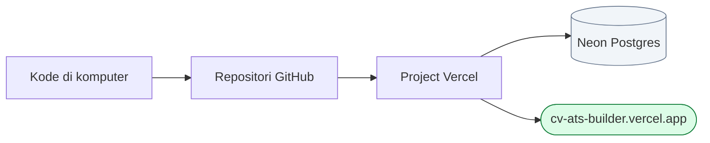

# Panduan Deploy

Menaikkan aplikasi ke internet lewat Vercel dan Neon. Seluruhnya gratis dan
tidak memerlukan kartu kredit.

Perkiraan waktu: 10-15 menit.

---

## Ringkasan



---

## 1. Naikkan kode ke GitHub

Repositori lokal sudah siap - riwayat commit-nya sudah ada.

1. Buat repositori **kosong** di <https://github.com/new>.
   - Nama saran: `cv-ats-builder`
   - **Jangan** centang "Add a README file", "Add .gitignore", maupun lisensi.
     Repositori harus benar-benar kosong agar tidak bentrok.
2. Hubungkan dan kirim dari folder project:

```bash
git remote add origin https://github.com/USERNAME/cv-ats-builder.git
git branch -M main
git push -u origin main
```

Berkas `.env` tidak akan ikut terkirim - sudah tercantum di `.gitignore`.

---

## 2. Buat project di Vercel

1. Buka <https://vercel.com/new>.
2. Pilih repositori `cv-ats-builder`, tekan **Import**.
3. Vercel mengenali Next.js secara otomatis. Perintah build sudah ditetapkan
   lewat berkas `vercel.json`, jadi tidak perlu diubah.
4. **Jangan tekan Deploy dulu.** Siapkan basis data terlebih dahulu (langkah
   berikutnya), sebab proses build menjalankan migrasi dan akan gagal bila
   `DATABASE_URL` belum ada.

---

## 3. Siapkan basis data

1. Di halaman project Vercel, buka tab **Storage**.
2. Tekan **Create Database**, pilih **Neon** (Serverless Postgres).
3. Pilih paket **Free**, wilayah terdekat (**Singapore** paling dekat dari
   Indonesia).
4. Setelah dibuat, tekan **Connect Project** dan pilih project ini.

Vercel akan menambahkan `DATABASE_URL` secara otomatis ke environment
variable project.

> Pastikan nilai yang dipakai adalah connection string **pooled**. Vercel
> mengisinya secara otomatis; ciri-cirinya memuat kata `-pooler` pada nama
> host.

---

## 4. Isi environment variable

Buka **Settings → Environment Variables**, lalu tambahkan:

| Nama | Nilai | Wajib |
|---|---|:--:|
| `DATABASE_URL` | terisi otomatis oleh Neon | ya |
| `AUTH_SECRET` | hasil perintah di bawah | ya |
| `AUTH_TRUST_HOST` | `true` | ya |
| `AUTH_GOOGLE_ID` | dari Google Cloud Console | tidak |
| `AUTH_GOOGLE_SECRET` | dari Google Cloud Console | tidak |

Membuat `AUTH_SECRET`:

```bash
node -e "console.log(require('crypto').randomBytes(32).toString('base64'))"
```

Terapkan untuk ketiga lingkungan: **Production**, **Preview**, dan
**Development**.

> `AUTH_SECRET` adalah kunci penandatanganan cookie sesi. Menggantinya di
> kemudian hari akan mengeluarkan seluruh pengguna yang sedang masuk -
> tidak menghapus data, hanya memaksa masuk ulang.

Kolom `AUTH_GOOGLE_*` boleh dikosongkan. Selama kosong, tombol "Masuk dengan
Google" otomatis disembunyikan dan login email + kata sandi tetap berfungsi
penuh.

---

## 5. Deploy

Tekan **Deploy**. Vercel akan menjalankan, berurutan:

1. `prisma generate` - membuat klien basis data
2. `prisma migrate deploy` - membuat seluruh tabel pada Neon
3. `next build` - membangun aplikasi

Setelah selesai, aplikasi dapat diakses di
`https://<nama-project>.vercel.app`.

---

## 6. Isi data awal (opsional)

Untuk menyediakan akun demo di production - berguna saat sidang, agar penguji
dapat langsung mencoba tanpa mendaftar:

```bash
# Salin DATABASE_URL dari Vercel, lalu jalankan dari folder project
DATABASE_URL="postgresql://..." npm run db:seed
```

Akun yang dihasilkan: `demo@atscv.local` / `demo12345`.

---

## 7. Menyalakan login Google (opsional)

> **Sudah dikerjakan.** Login Google pada pemasangan ini sudah aktif dan
> berstatus *In production* pada project Google Cloud `CV ATS Builder`
> (id `bold-upgrade-507408-a0`). Langkah di bawah hanya diperlukan bila
> aplikasi dipasang ulang di akun lain, atau bila domainnya berganti -
> dalam hal itu tambahkan alamat callback domain baru pada OAuth Client ID.

1. Buka <https://console.cloud.google.com/>, buat sebuah project.
2. **APIs & Services → OAuth consent screen**: pilih External, isi nama
   aplikasi dan email dukungan.
3. **APIs & Services → Credentials → Create Credentials → OAuth client ID**,
   pilih **Web application**.
4. Pada **Authorized redirect URIs**, tambahkan keduanya:
   - `https://NAMA-PROJECT.vercel.app/api/auth/callback/google`
   - `http://localhost:3000/api/auth/callback/google`
5. Salin Client ID dan Client Secret ke environment variable Vercel.
6. Jalankan **Redeploy** agar nilai barunya terbaca.

---

## 8. Setelah deploy: daftar periksa

Lakukan pengujian berikut pada alamat production, bukan hanya di lokal.

| # | Yang diuji | Hasil yang diharapkan |
|---|---|---|
| 1 | Buka halaman depan | Tampil utuh, alamat memakai HTTPS |
| 2 | Daftar akun baru | Berhasil dan langsung masuk |
| 3 | Buat CV lewat "Mulai dari Contoh" | Editor terbuka dengan data contoh |
| 4 | Ubah sebuah field | Muncul tulisan "Tersimpan" dalam hitungan detik |
| 5 | Tutup browser, buka lagi, masuk | Seluruh perubahan masih ada |
| 6 | Unduh PDF | Berkas terbuka, teksnya dapat diseleksi dan disalin |
| 7 | Unduh Word | Terbuka rapi di Word atau Google Docs |
| 8 | Buka dari ponsel | Bilah navigasi bawah muncul, pratinjau muat selebar layar |
| 9 | Daftar akun kedua | CV akun pertama tidak terlihat |
| 10 | Buka `/resume/<id-milik-akun-lain>/edit` | Halaman "tidak ditemukan" |

---

## Masalah yang mungkin muncul

| Gejala | Sebab dan solusi |
|---|---|
| Build gagal pada tahap `prisma migrate deploy` | `DATABASE_URL` belum ada atau salah. Periksa Settings → Environment Variables, lalu Redeploy |
| Build berhasil tetapi halaman menampilkan galat | Biasanya `AUTH_SECRET` belum diisi. Tambahkan lalu Redeploy |
| Login Google menampilkan `redirect_uri_mismatch` | Alamat callback di Google Cloud Console harus sama persis dengan domain production, termasuk `https://` dan tanpa garis miring di akhir |
| Galat koneksi basis data saat lalu lintas ramai | Pastikan memakai connection string **pooled** dari Neon (nama host memuat `-pooler`) |
| Perubahan kode tidak muncul | Vercel hanya membangun ulang saat ada commit baru di branch `main`. Jalankan `git push` |
