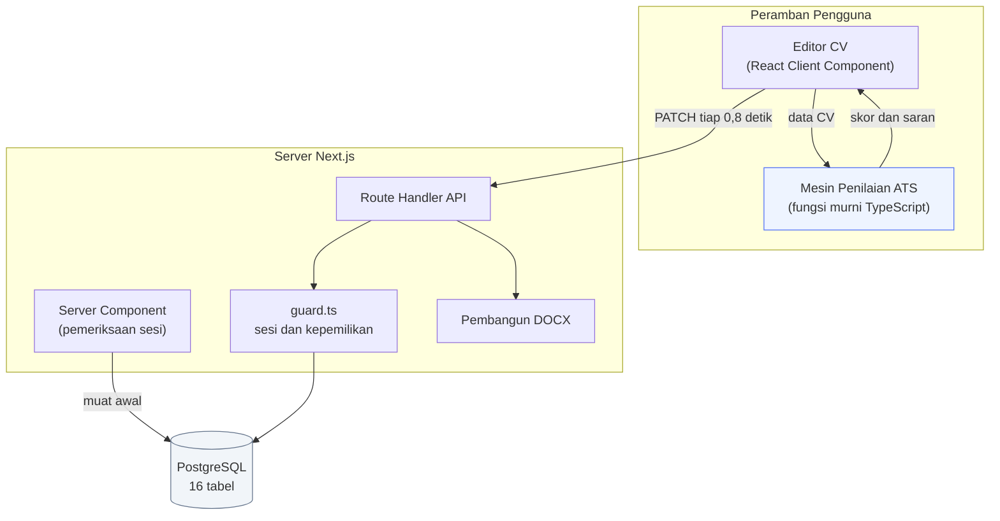
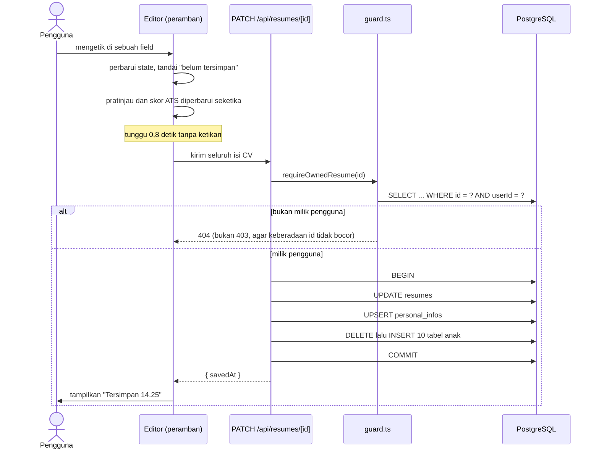
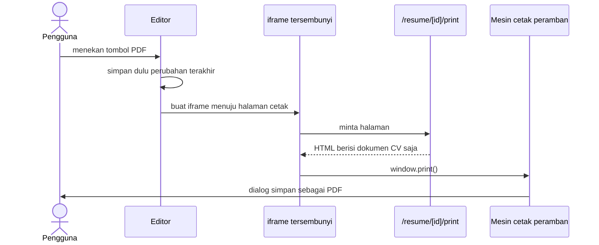

# Dokumentasi Teknis

Berkas ini ditujukan sebagai bahan lampiran laporan: rancangan basis data,
arsitektur, alur proses, dan rincian aturan penilaian ATS.

Diagram ditulis dalam sintaks [Mermaid](https://mermaid.js.org), yang dirender
otomatis oleh GitHub dan sebagian besar editor Markdown.

---

## 1. Arsitektur Sistem



Dua hal yang membedakan rancangan ini:

1. **Mesin penilaian berjalan di sisi klien.** Karena seluruh aturannya berupa
   fungsi murni tanpa akses jaringan maupun basis data, modul yang sama dapat
   dijalankan di peramban maupun di server. Akibatnya skor ikut berubah
   seketika saat pengguna mengetik, tanpa satu pun permintaan jaringan.
   Endpoint `POST /api/resumes/[id]/ats` tetap ada, khusus untuk mencatat
   hasil penilaian ke riwayat.

2. **Dokumen CV adalah satu komponen yang dipakai bersama.**
   `ResumeDocument` dirender di panel pratinjau maupun di halaman cetak,
   sehingga tidak mungkin terjadi selisih antara yang dilihat pengguna dan
   yang tercetak di PDF.

---

## 2. Rancangan Basis Data

### 2.1 Diagram Relasi Entitas

```mermaid
erDiagram
    users ||--o{ accounts : "menautkan"
    users ||--o{ resumes : "memiliki"

    resumes ||--|| personal_infos : "identitas"
    resumes ||--o{ experiences : ""
    resumes ||--o{ educations : ""
    resumes ||--o{ skills : ""
    resumes ||--o{ projects : ""
    resumes ||--o{ certifications : ""
    resumes ||--o{ organizations : ""
    resumes ||--o{ awards : ""
    resumes ||--o{ language_skills : ""
    resumes ||--o{ publications : ""
    resumes ||--o{ custom_sections : ""
    resumes ||--o{ ats_analyses : "riwayat nilai"

    users {
        string id PK
        string email UK
        string name
        string passwordHash "NULL bila daftar via Google"
        datetime emailVerified
        datetime createdAt
    }

    accounts {
        string id PK
        string userId FK
        string provider
        string providerAccountId
    }

    resumes {
        string id PK
        string userId FK
        string title
        enum template "CLASSIC MODERN COMPACT"
        string accentColor
        string fontFamily
        int fontSize
        float lineHeight
        enum language "ID EN"
        json sectionOrder
        datetime updatedAt
    }

    personal_infos {
        string id PK
        string resumeId FK_UK
        string fullName
        string headline
        string email
        string phone
        string city
        string summary
        bool showPhoto
    }

    experiences {
        string id PK
        string resumeId FK
        string jobTitle
        string company
        enum employmentType
        string startDate "YYYY-MM"
        string endDate "YYYY-MM"
        bool isCurrent
        string_array bullets
        int order
    }

    ats_analyses {
        string id PK
        string resumeId FK
        int score
        json breakdown
        json suggestions
        string jobDescription
        datetime createdAt
    }
```

Tabel `educations`, `skills`, `projects`, `certifications`, `organizations`,
`awards`, `language_skills`, `publications`, dan `custom_sections` mengikuti
pola yang sama dengan `experiences`: kunci asing `resumeId`, kolom `order`
untuk urutan tampil, dan `ON DELETE CASCADE`.

### 2.2 Keputusan Perancangan

| Keputusan | Alasan |
|---|---|
| Tanggal disimpan sebagai `String` berformat `"YYYY-MM"` | CV hanya memerlukan presisi bulan. Format ini cocok dengan `<input type="month">` dan bebas dari kesalahan zona waktu yang timbul bila memakai tipe `DateTime`. Keseragamannya juga menjadi salah satu butir penilaian keterbacaan mesin. |
| Kolom teks berdefault `""`, bukan `NULL` | Membuat penanganan form di frontend seragam; tidak perlu pemeriksaan null di setiap tempat. |
| `bullets` memakai tipe array asli PostgreSQL | Poin pencapaian selalu dibaca dan ditulis sebagai satu kesatuan bersama entri induknya, sehingga tidak memerlukan tabel tersendiri. |
| `sectionOrder` disimpan sebagai JSON | Urutan section adalah preferensi tampilan, bukan entitas yang perlu dicari atau direlasikan. |
| `ats_analyses` menyimpan riwayat, bukan hanya nilai terakhir | Memungkinkan analisis perkembangan skor sebelum dan sesudah pengguna memperbaiki CV - berguna sebagai data pengamatan penelitian. |
| Seluruh tabel anak `ON DELETE CASCADE` | Penghapusan CV maupun akun tidak menyisakan baris yatim. Diverifikasi lewat kueri `LEFT JOIN ... WHERE r.id IS NULL`. |

---

## 3. Alur Proses

### 3.1 Simpan Otomatis



Penulisan ulang seluruh baris anak dipilih alih-alih membandingkan baris satu
per satu. Karena id setiap entri dibuat di sisi klien dan ikut dikirim, kunci
primer tetap stabil antar-penyimpanan, sementara jumlah kueri tetap dua per
tabel berapa pun banyaknya entri. Untuk dokumen sekecil CV, pendekatan ini
lebih sederhana sekaligus lebih kecil peluang salahnya.

### 3.2 Menghasilkan PDF



Halaman cetak sengaja dibuat terpisah dan hanya berisi dokumen CV, sehingga
tidak ada satu pun elemen antarmuka yang perlu disembunyikan lewat CSS.
Karena yang dicetak adalah HTML biasa, teks pada PDF tetap berupa teks -
dapat diseleksi, disalin, dan diurai mesin.

---

## 4. Aturan Penilaian ATS

Kode: `src/lib/ats/engine.ts`. Kosakata pendukung: `src/lib/ats/vocabulary.ts`.

Setiap dimensi menghimpun sejumlah aturan bernilai poin. Nilai dimensi adalah
`(poin diperoleh / poin maksimum) x bobot dimensi`.

### 4.1 Kelengkapan Data - bobot 25%

| Aturan | Poin | Tingkat |
|---|---:|---|
| Nama lengkap terisi | 4 | wajib |
| Email berformat sah | 4 | wajib |
| Nomor telepon minimal 8 digit | 3 | wajib |
| Jabatan yang dituju terisi | 2 | disarankan |
| Domisili terisi | 2 | disarankan |
| Ringkasan profil 30-120 kata | 4 | wajib bila kosong |
| Minimal 1 pengalaman kerja atau 2 proyek | 4 | wajib |
| Minimal 1 riwayat pendidikan | 2 | disarankan |
| Minimal 5 keahlian | 3 | disarankan |
| Minimal 1 tautan profil | 2 | saran |

### 4.2 Keterbacaan Mesin - bobot 25%

| Aturan | Poin | Dasar |
|---|---:|---|
| Pas foto dimatikan | 3 | Pengurai umumnya tidak membaca gambar, dan tata letak di sekitarnya merusak urutan teks |
| Jenis huruf termasuk yang aman | 3 | Huruf yang tidak tersedia di sistem penerima akan disubstitusi |
| Ukuran huruf 9-12 pt | 2 | Di bawah 9 pt menyulitkan pembacaan maupun OCR |
| Seluruh tanggal berformat seragam | 5 | Format campur aduk membuat lama pengalaman gagal dihitung |
| Setiap pengalaman punya jabatan dan perusahaan | 5 | Pengurai memetakan pengalaman lewat pasangan ini |
| Setiap pengalaman punya tanggal mulai | 4 | Dasar penghitungan lama pengalaman |
| Setiap pendidikan punya institusi dan jenjang | 3 | - |
| Nama keahlian bebas keterangan tingkat | 3 | Pencocokan kata kunci dilakukan secara harfiah |
| Tidak ada karakter pemisah kolom pada poin | 2 | Karakter `|` dan tab memicu dugaan struktur tabel |
| Judul section tambahan tanpa emoji | 2 | Emoji tidak dikenali pengurai |

### 4.3 Kualitas Konten - bobot 20%

| Aturan | Poin | Ambang peringatan |
|---|---:|---|
| Poin diawali kata kerja aksi | 6 | di bawah 70% |
| Poin memuat angka terukur | 5 | di bawah 50% |
| Panjang poin maksimal 220 karakter | 3 | di bawah 90% |
| Panjang poin minimal 40 karakter | 2 | di bawah 80% |
| Bebas frasa klise | 3 | ada satu pun |
| Ringkasan tanpa kata ganti orang pertama | 2 | - |
| Setiap pengalaman punya minimal 2 poin | 3 | - |

### 4.4 Kecocokan Kata Kunci - bobot 20%

Berlaku hanya bila pengguna menempelkan iklan lowongan.

Tahapannya:

1. Teks lowongan dipecah menjadi token, dengan titik, plus, dan tagar
   dipertahankan agar `node.js`, `c++`, dan `c#` tidak terpotong.
2. Kata henti dibuang. Daftarnya mencakup kata fungsi bahasa Indonesia dan
   Inggris, ditambah kosakata boilerplate iklan lowongan
   (`kualifikasi`, `tanggung`, `jawab`, `requirements`) serta kata kerja
   penghubung (`menguasai`, `memahami`, `terbiasa`). Tanpa penyaringan
   terakhir ini, kata kerja penghubung mendominasi peringkat teratas dan
   menggeser kata kunci keahlian yang sesungguhnya.
3. Frasa dua kata yang muncul minimal dua kali diberi bobot ganda, sebab
   frasa demikian umumnya merupakan nama keahlian yang utuh
   (`machine learning`, `react native`).
4. Setiap kata kunci dicocokkan ke teks polos CV memakai batas kata, sehingga
   `java` tidak dianggap cocok pada `javascript`.
5. Cakupan dihitung sebagai rasio bobot kata kunci yang ditemukan terhadap
   total bobot.

### 4.5 Panjang dan Struktur - bobot 10%

| Aturan | Poin |
|---|---:|
| Panjang CV 1-2 halaman | 4 |
| Ringkasan profil berada sebelum pengalaman kerja | 2 |
| Pengalaman tersusun kronologis terbalik | 2 |
| Tidak ada jeda kerja lebih dari 12 bulan | 2 |

### 4.6 Penanganan Dimensi yang Tidak Berlaku

Dua keadaan membuat sebuah dimensi tidak dinilai:

1. **Iklan lowongan belum ditempelkan** - dimensi kecocokan kata kunci tidak
   dihitung.
2. **CV belum berisi apa pun** - dimensi keterbacaan mesin dan struktur tidak
   dihitung. Tanpa penjagaan ini, dokumen kosong justru memperoleh nilai penuh
   pada kedua dimensi tersebut, sebab seluruh aturannya berbentuk
   "tidak boleh ada X" dan pada dokumen kosong memang tidak ada X apa pun.

Bobot dimensi yang tidak berlaku dikeluarkan dari pembagi, sehingga skor akhir
tetap berada pada skala 0-100:

```
skor = (jumlah nilai dimensi berlaku / jumlah bobot dimensi berlaku) x 100
```

### 4.7 Hasil Pengujian Kalibrasi

| Keadaan CV | Skor | Nilai |
|---|---:|---|
| CV kosong (baru dibuat) | 4 | D |
| CV contoh, tanpa iklan lowongan | 98 | A |
| CV contoh (Frontend) vs lowongan Frontend Developer | 94 | A |
| CV contoh (Frontend) vs lowongan Backend Engineer | 85 | A |

Selisih pada dua baris terakhir memperlihatkan bahwa dimensi kecocokan kata
kunci memang membedakan CV yang relevan dari yang kurang relevan terhadap
lowongan tertentu, meski mutu penulisan CV-nya sama.

---

## 5. Keamanan

| Aspek | Penerapan |
|---|---|
| Penyimpanan kata sandi | bcrypt 12 putaran. Kolom `passwordHash` berisi 60 karakter; kata sandi asli tidak pernah disimpan maupun dicatat. |
| Kepemilikan data | `requireOwnedResume` menyertakan `userId` langsung pada klausa `WHERE`, bukan memeriksanya setelah data terambil. CV milik orang lain menghasilkan **404**, bukan 403, sehingga keberadaan sebuah id tidak bocor. |
| Pesan galat login | Tidak membedakan "email tidak terdaftar" dan "kata sandi salah", agar tidak dapat dipakai menebak email mana yang terdaftar. |
| Penautan akun Google | Hanya dilakukan bila Google sudah memverifikasi kepemilikan email (`profile.email_verified`). Tanpa pemeriksaan ini, akun Google beralamat sama berpotensi mengambil alih akun. |
| Penggantian kata sandi | Mewajibkan kata sandi lama bagi akun yang sudah memilikinya. |
| Validasi masukan | Seluruh payload diperiksa dengan skema Zod sebelum menyentuh basis data. |
| Penghapusan akun | Meminta pengguna mengetik `HAPUS AKUN` secara persis. |

---

## 6. Hasil Verifikasi

Pengujian dilakukan terhadap aplikasi yang benar-benar berjalan.

| Yang diuji | Cara | Hasil |
|---|---|---|
| Kata sandi tidak tersimpan polos | Membaca langsung tabel `users` | `$2b$12$...`, 60 karakter |
| Proteksi halaman | Membuka `/dashboard` tanpa sesi | 307 ke `/login` |
| Proteksi API | `GET /api/resumes` tanpa sesi | 401 |
| Persistensi data | Menyimpan, lalu membuka dengan sesi yang benar-benar baru | Seluruh perubahan utuh |
| Isolasi antar-pengguna | Akun kedua mencoba baca, ubah, dan hapus CV akun pertama | 404 pada semua percobaan; data tidak berubah |
| Integritas relasi | `LEFT JOIN` mencari baris anak tanpa induk | 0 baris yatim |
| Siklus JSON | Ekspor, hapus CV, impor kembali, bandingkan | Identik di luar id dan judul |
| Duplikasi | Membandingkan himpunan id entri asli dan salinan | Tidak ada id yang bertabrakan |
| Teks PDF | Membuat PDF sungguhan lalu mengekstraksi teksnya | 77 baris terekstraksi, urutan benar, seluruh field kunci ditemukan |
| Struktur DOCX | Membuka isi berkas `.docx` | Tanpa tabel, tanpa kotak teks, tanpa header/footer, memakai daftar berpoin asli Word |
| Galat peramban | Menelusuri seluruh halaman sambil merekam console | 0 galat |
| Build production | `npm run build` | Berhasil, 20 route |

---

## 7. Batasan yang Diketahui

Disebutkan terbuka agar dapat ditulis pada bab keterbatasan penelitian.

1. **Penilaian mensimulasikan kaidah umum ATS, bukan sebuah produk ATS
   tertentu.** Setiap vendor (Workday, Greenhouse, Taleo) memiliki pengurai
   sendiri yang tidak dipublikasikan. Aturan di sini disusun dari kaidah yang
   berlaku umum, sehingga skor tinggi berarti "memenuhi kaidah yang diperiksa",
   bukan jaminan lolos pada sistem tertentu.
2. **Pencocokan kata kunci bersifat leksikal.** `frontend` dan `front-end`
   dikenali berbeda, dan sinonim tidak dikenali. Penambahan pencocokan
   semantik merupakan arah pengembangan lanjutan.
3. **Foto diunggah lewat URL, bukan berkas.** Aplikasi belum menyediakan
   penyimpanan berkas.
4. **Perkiraan jumlah halaman pada mesin penilaian bersifat heuristik.**
   Antarmuka editor menampilkan jumlah halaman sebenarnya dari hasil
   pengukuran DOM; angka heuristik hanya dipakai saat penilaian dijalankan di
   sisi server tanpa proses render.
5. **Belum ada berkas uji otomatis di dalam repositori.** Verifikasi pada
   bagian 6 dilakukan lewat skrip terpisah terhadap aplikasi yang berjalan.
