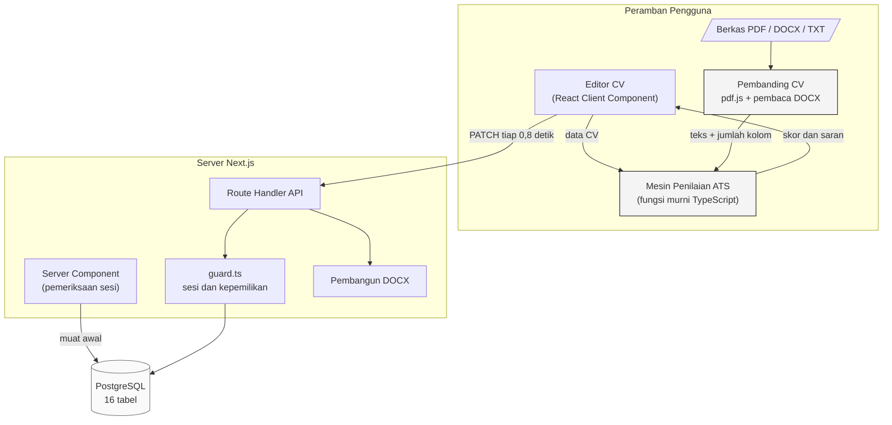
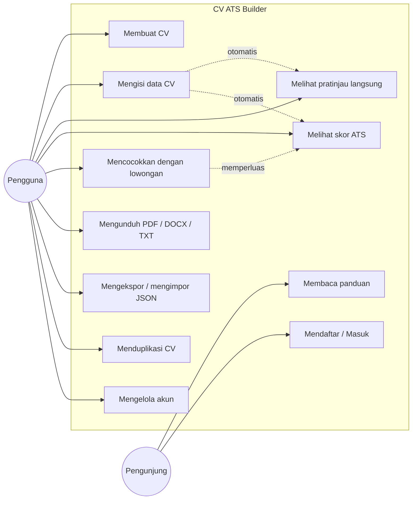
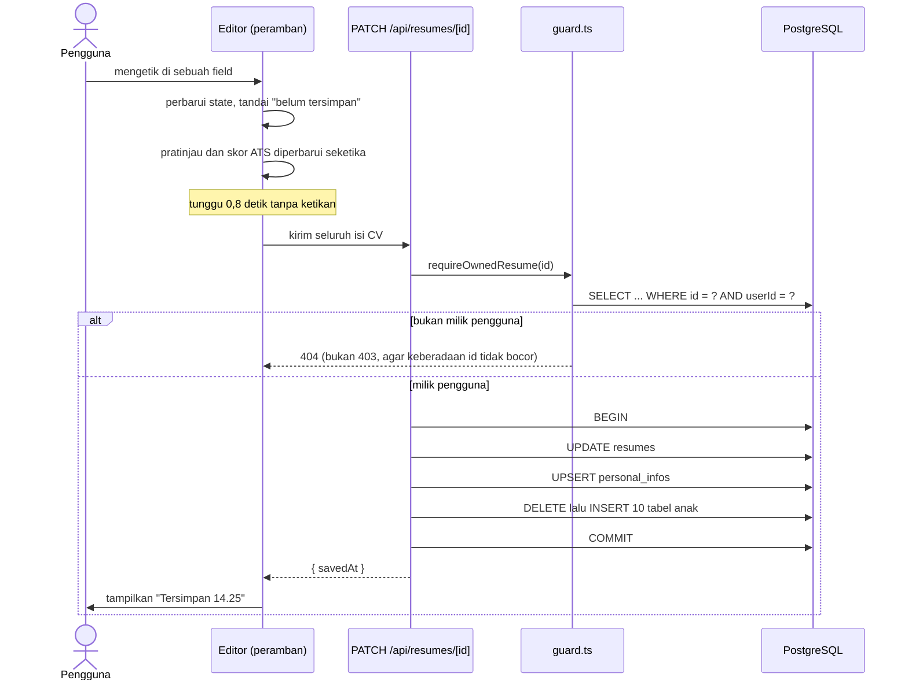
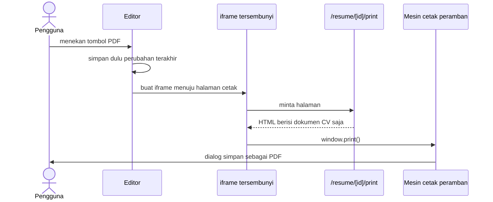

# Dokumentasi Teknis

Berkas ini ditujukan sebagai bahan lampiran laporan: rancangan basis data,
arsitektur, alur proses, dan rincian aturan penilaian ATS.

Diagram ditulis dalam sintaks [Mermaid](https://mermaid.js.org), yang dirender
otomatis oleh GitHub dan sebagian besar editor Markdown.

Selain diagram Mermaid di berkas ini, tersedia pula empat diagram alur yang
**dibangkitkan langsung dari kode** - alur menyusun CV, alur membandingkan CV,
arsitektur dan alur data, serta workflow pengembangan. Keempatnya ada dalam
bentuk SVG dan PNG, dua bahasa, di folder [`docs/diagram/`](diagram/), dan
dapat dibangun ulang dengan `npm run diagram`. Sumbernya satu berkas:
`src/lib/diagrams.ts`, yang juga melayani halaman `/alur` di aplikasinya -
sehingga diagram di laporan tidak mungkin bercerita berbeda dari aplikasinya.

---

## 1. Arsitektur Sistem



Perhatikan bahwa kotak **Pembanding CV** tidak memiliki satu pun panah menuju
Server. Itu disengaja: berkas CV yang diunggah untuk dibandingkan dibaca dan
dinilai sepenuhnya di dalam peramban, dan tidak pernah dikirim ke mana pun.
Konsekuensi yang menguntungkan: fitur itu dapat dipakai tanpa akun.

Dua hal yang membedakan rancangan ini:

1. **Mesin penilaian berjalan di sisi klien.** Karena seluruh aturannya berupa
   fungsi murni tanpa akses jaringan maupun basis data, modul yang sama dapat
   dijalankan di peramban maupun di server. Akibatnya skor ikut berubah
   seketika saat pengguna mengetik, tanpa satu pun permintaan jaringan.
   Endpoint `POST /api/resumes/[id]/ats` tetap ada, khusus untuk mencatat
   hasil penilaian ke riwayat.

2. **Dokumen CV adalah satu komponen yang dipakai bersama.**
   `ResumeDocument` dirender di panel pratinjau, di halaman cetak, dan pada
   pratinjau kesepuluh template di halaman depan - sehingga tidak mungkin
   terjadi selisih antara yang dilihat pengguna dan yang tercetak di PDF, dan
   tidak ada gambar pratinjau yang perlu dibuat ulang saat template berubah.

3. **Berkas CV dari luar dinilai tanpa meninggalkan perangkat pengguna.**
   pdf.js dan pembaca DOCX berjalan di peramban; yang menyeberang ke server
   hanyalah CV yang memang sengaja disusun pengguna di dalam aplikasi ini.

---

## 1b. Diagram Use Case



Pengunjung yang belum masuk hanya dapat membaca halaman publik (beranda,
panduan, tentang) dan mendaftar. Seluruh operasi terhadap data CV menuntut
sesi yang sah, dan tiap operasi memeriksa kepemilikan datanya sendiri.

---

## 2. Rancangan Basis Data

### 2.1 Diagram Relasi Entitas

```mermaid
erDiagram
    users ||--o{ accounts : "menautkan"
    users ||--o{ resumes : "memiliki"

    resumes ||--|| personal_infos : "identitas"
    resumes ||--o{ experiences : ""
    resumes ||--o{ educations : ""
    resumes ||--o{ skills : ""
    resumes ||--o{ projects : ""
    resumes ||--o{ certifications : ""
    resumes ||--o{ organizations : ""
    resumes ||--o{ awards : ""
    resumes ||--o{ language_skills : ""
    resumes ||--o{ publications : ""
    resumes ||--o{ custom_sections : ""
    resumes ||--o{ ats_analyses : "riwayat nilai"

    users {
        string id PK
        string email UK
        string name
        string passwordHash "NULL bila daftar via Google"
        datetime emailVerified
        datetime createdAt
    }

    accounts {
        string id PK
        string userId FK
        string provider
        string providerAccountId
    }

    resumes {
        string id PK
        string userId FK
        string title
        enum template "CLASSIC MODERN COMPACT"
        string accentColor
        string fontFamily
        int fontSize
        float lineHeight
        enum language "ID EN"
        json sectionOrder
        datetime updatedAt
    }

    personal_infos {
        string id PK
        string resumeId FK_UK
        string fullName
        string headline
        string email
        string phone
        string city
        string summary
        bool showPhoto
    }

    experiences {
        string id PK
        string resumeId FK
        string jobTitle
        string company
        enum employmentType
        string startDate "YYYY-MM"
        string endDate "YYYY-MM"
        bool isCurrent
        string_array bullets
        int order
    }

    ats_analyses {
        string id PK
        string resumeId FK
        int score
        json breakdown
        json suggestions
        string jobDescription
        datetime createdAt
    }
```

Tabel `educations`, `skills`, `projects`, `certifications`, `organizations`,
`awards`, `language_skills`, `publications`, dan `custom_sections` mengikuti
pola yang sama dengan `experiences`: kunci asing `resumeId`, kolom `order`
untuk urutan tampil, dan `ON DELETE CASCADE`.

### 2.2 Keputusan Perancangan

| Keputusan | Alasan |
|---|---|
| Tanggal disimpan sebagai `String` berformat `"YYYY-MM"` | CV hanya memerlukan presisi bulan. Format ini cocok dengan `<input type="month">` dan bebas dari kesalahan zona waktu yang timbul bila memakai tipe `DateTime`. Keseragamannya juga menjadi salah satu butir penilaian keterbacaan mesin. |
| Kolom teks berdefault `""`, bukan `NULL` | Membuat penanganan form di frontend seragam; tidak perlu pemeriksaan null di setiap tempat. |
| `bullets` memakai tipe array asli PostgreSQL | Poin pencapaian selalu dibaca dan ditulis sebagai satu kesatuan bersama entri induknya, sehingga tidak memerlukan tabel tersendiri. |
| `sectionOrder` disimpan sebagai JSON | Urutan section adalah preferensi tampilan, bukan entitas yang perlu dicari atau direlasikan. |
| `ats_analyses` menyimpan riwayat, bukan hanya nilai terakhir | Memungkinkan analisis perkembangan skor sebelum dan sesudah pengguna memperbaiki CV - berguna sebagai data pengamatan penelitian. |
| Seluruh tabel anak `ON DELETE CASCADE` | Penghapusan CV maupun akun tidak menyisakan baris yatim. Diverifikasi lewat kueri `LEFT JOIN ... WHERE r.id IS NULL`. |

---

## 3. Alur Proses

### 3.1 Simpan Otomatis



Penulisan ulang seluruh baris anak dipilih alih-alih membandingkan baris satu
per satu. Karena id setiap entri dibuat di sisi klien dan ikut dikirim, kunci
primer tetap stabil antar-penyimpanan, sementara jumlah kueri tetap dua per
tabel berapa pun banyaknya entri. Untuk dokumen sekecil CV, pendekatan ini
lebih sederhana sekaligus lebih kecil peluang salahnya.

### 3.2 Menghasilkan PDF



Halaman cetak sengaja dibuat terpisah dan hanya berisi dokumen CV, sehingga
tidak ada satu pun elemen antarmuka yang perlu disembunyikan lewat CSS.
Karena yang dicetak adalah HTML biasa, teks pada PDF tetap berupa teks -
dapat diseleksi, disalin, dan diurai mesin.

---

## 4. Aturan Penilaian ATS

Kode: `src/lib/ats/engine.ts`. Kosakata pendukung: `src/lib/ats/vocabulary.ts`.

Setiap dimensi menghimpun sejumlah aturan bernilai poin. Nilai dimensi adalah
`(poin diperoleh / poin maksimum) x bobot dimensi`.

### 4.1 Kelengkapan Data - bobot 25%

| Aturan | Poin | Tingkat |
|---|---:|---|
| Nama lengkap terisi | 4 | wajib |
| Email berformat sah | 4 | wajib |
| Nomor telepon minimal 8 digit | 3 | wajib |
| Jabatan yang dituju terisi | 2 | disarankan |
| Domisili terisi | 2 | disarankan |
| Ringkasan profil 30-120 kata | 4 | wajib bila kosong |
| Minimal 1 pengalaman kerja atau 2 proyek | 4 | wajib |
| Minimal 1 riwayat pendidikan | 2 | disarankan |
| Minimal 5 keahlian | 3 | disarankan |
| Minimal 1 tautan profil | 2 | saran |

### 4.2 Keterbacaan Mesin - bobot 25%

| Aturan | Poin | Dasar |
|---|---:|---|
| Pas foto dimatikan | 3 | Pengurai umumnya tidak membaca gambar, dan tata letak di sekitarnya merusak urutan teks |
| Jenis huruf termasuk yang aman | 3 | Huruf yang tidak tersedia di sistem penerima akan disubstitusi |
| Ukuran huruf 9-12 pt | 2 | Di bawah 9 pt menyulitkan pembacaan maupun OCR |
| Seluruh tanggal berformat seragam | 5 | Format campur aduk membuat lama pengalaman gagal dihitung |
| Setiap pengalaman punya jabatan dan perusahaan | 5 | Pengurai memetakan pengalaman lewat pasangan ini |
| Setiap pengalaman punya tanggal mulai | 4 | Dasar penghitungan lama pengalaman |
| Setiap pendidikan punya institusi dan jenjang | 3 | - |
| Nama keahlian bebas keterangan tingkat | 3 | Pencocokan kata kunci dilakukan secara harfiah |
| Tidak ada karakter pemisah kolom pada poin | 2 | Karakter `|` dan tab memicu dugaan struktur tabel |
| Judul section tambahan tanpa emoji | 2 | Emoji tidak dikenali pengurai |

### 4.3 Kualitas Konten - bobot 20%

| Aturan | Poin | Ambang peringatan |
|---|---:|---|
| Poin diawali kata kerja aksi | 6 | di bawah 70% |
| Poin memuat angka terukur | 5 | di bawah 50% |
| Panjang poin maksimal 220 karakter | 3 | di bawah 90% |
| Panjang poin minimal 40 karakter | 2 | di bawah 80% |
| Bebas frasa klise | 3 | ada satu pun |
| Ringkasan tanpa kata ganti orang pertama | 2 | - |
| Setiap pengalaman punya minimal 2 poin | 3 | - |

### 4.4 Kecocokan Kata Kunci - bobot 20%

Berlaku hanya bila pengguna menempelkan iklan lowongan.

Tahapannya:

1. Teks lowongan dipecah menjadi token, dengan titik, plus, dan tagar
   dipertahankan agar `node.js`, `c++`, dan `c#` tidak terpotong.
2. Kata henti dibuang. Daftarnya mencakup kata fungsi bahasa Indonesia dan
   Inggris, ditambah kosakata boilerplate iklan lowongan
   (`kualifikasi`, `tanggung`, `jawab`, `requirements`) serta kata kerja
   penghubung (`menguasai`, `memahami`, `terbiasa`). Tanpa penyaringan
   terakhir ini, kata kerja penghubung mendominasi peringkat teratas dan
   menggeser kata kunci keahlian yang sesungguhnya.
3. Frasa dua kata yang muncul minimal dua kali diberi bobot ganda, sebab
   frasa demikian umumnya merupakan nama keahlian yang utuh
   (`machine learning`, `react native`).
4. Setiap kata kunci dicocokkan ke teks polos CV memakai batas kata, sehingga
   `java` tidak dianggap cocok pada `javascript`.
5. Cakupan dihitung sebagai rasio bobot kata kunci yang ditemukan terhadap
   total bobot.

### 4.5 Panjang dan Struktur - bobot 10%

| Aturan | Poin |
|---|---:|
| Panjang CV - bertingkat, lihat di bawah | 4 |
| Ringkasan profil berada sebelum pengalaman kerja | 2 |
| Pengalaman tersusun kronologis terbalik | 2 |
| Tidak ada jeda kerja lebih dari 12 bulan | 2 |

Aturan panjang CV **tidak** berbentuk lolos-atau-gagal, melainkan bertingkat:

| Jumlah halaman | Bagian nilai yang diperoleh |
|---:|---:|
| 1 | 100% |
| 2 | 75% |
| 3 ke atas | 25% |

Satu halaman memperoleh nilai penuh karena itulah panjang yang benar untuk
hampir semua pelamar: perekrut memindai CV dalam hitungan detik, dan apa pun
yang jatuh ke halaman kedua besar kemungkinan tidak pernah dibaca. Dua halaman
tetap memperoleh sebagian besar nilainya - bagi pelamar dengan pengalaman
panjang yang seluruhnya relevan, memaksakan satu halaman justru membuang bukti.
Meski demikian, saran memadatkannya tetap ditampilkan pada CV dua halaman:
pengguna berhak tahu bahwa satu halaman lebih baik, lalu memutuskan sendiri.

Ukuran kertas (A4, Letter, Legal, F4) dan margin tidak ikut dinilai. Keduanya
menentukan berapa halaman isi yang sama akan memakan tempat, dan pengaruh itu
sudah tercermin pada jumlah halamannya.

#### Catatan penerapan: margin halaman berasal dari @page, bukan dari padding

Sempat terdapat cacat yang perlu dicatat karena mudah terulang. Margin halaman
semula berupa properti `padding` pada elemen kertas, sementara aturan cetaknya
`@page { margin: 0 }`.

Padding hanya berlaku **sekali untuk seluruh dokumen yang mengalir**. Akibatnya
pada CV lebih dari satu halaman: halaman pertama memperoleh margin atas,
halaman terakhir memperoleh margin bawah, dan setiap pergantian halaman di
antaranya tidak memperoleh apa pun - teks di dasar halaman menempel ke tepi
kertas, dan halaman berikutnya dimulai dari tepi atas. Cacat ini ikut terbawa
ke berkas PDF, bukan sekadar tampil salah di layar.

Perbaikannya memindahkan margin ke `@page { margin: <atas-bawah> <kiri-kanan> }`
yang memang berlaku pada setiap halaman, dan mengosongkan padding kertas saat
mencetak. Pratinjau per halaman meniru hal yang sama: dokumennya dirender tanpa
margin atas-bawah, lalu tiap lembar menyediakannya sendiri. Tinggi yang
benar-benar dapat diisi menjadi

```
tinggi terpakai = tinggi kertas - margin atas - margin bawah
```

dan satuan itulah yang dipakai menghitung jumlah halaman sekaligus menggeser
isi tiap lembar - sehingga pratinjau dan hasil PDF memotong di tempat yang
persis sama. Berkas Word memakai angka yang sama pula.

Margin bawaannya mengikuti template, tetapi dapat disetel pengguna 8-30 mm dan
disimpan pada kolom `resumes.marginYMm` dan `marginXMm`. Keduanya boleh NULL,
dan NULL berarti "ikut template" - disimpan begitu, bukan disalin angkanya,
supaya CV yang belum pernah disetel manual ikut menyesuaikan sendiri ketika
templatenya diganti.

### 4.6 Penanganan Dimensi yang Tidak Berlaku

Dua keadaan membuat sebuah dimensi tidak dinilai:

1. **Iklan lowongan belum ditempelkan** - dimensi kecocokan kata kunci tidak
   dihitung.
2. **CV belum berisi apa pun** - dimensi keterbacaan mesin dan struktur tidak
   dihitung. Tanpa penjagaan ini, dokumen kosong justru memperoleh nilai penuh
   pada kedua dimensi tersebut, sebab seluruh aturannya berbentuk
   "tidak boleh ada X" dan pada dokumen kosong memang tidak ada X apa pun.

Bobot dimensi yang tidak berlaku dikeluarkan dari pembagi, sehingga skor akhir
tetap berada pada skala 0-100:

```
skor = (jumlah nilai dimensi berlaku / jumlah bobot dimensi berlaku) x 100
```

### 4.7 Hasil Pengujian Kalibrasi

| Keadaan CV | Skor | Nilai |
|---|---:|---|
| CV kosong (baru dibuat) | 4 | D |
| CV contoh, satu halaman, tanpa iklan lowongan | 98 | A |
| CV contoh, dua halaman | 96 | A |
| CV contoh, empat halaman | 91 | A |
| CV contoh dengan pas foto | 95 | A |
| CV contoh (Frontend) vs lowongan Frontend Developer | 94 | A |
| CV contoh (Frontend) vs lowongan Backend Engineer | 85 | A |

Dua baris terakhir memperlihatkan bahwa dimensi kecocokan kata kunci memang
membedakan CV yang relevan dari yang kurang relevan terhadap lowongan tertentu,
meski mutu penulisan CV-nya sama.

Seluruh angka pada tabel ini dikunci oleh berkas uji `tests/ats-engine.test.ts`,
sehingga perubahan aturan penilaian yang tidak disengaja akan langsung terlihat
sebagai kegagalan `npm test`.

### 4.8 Penilai Berkas CV yang Diunggah

Fitur bandingkan dan pindai CV memakai mesin **terpisah**
(`src/lib/ats/document.ts`). Pemisahan ini disengaja: mesin di bagian 4
menilai CV terstruktur yang setiap fieldnya diketahui, sedangkan mesin ini
menerima teks apa adanya dari berkas PDF atau Word dan harus menebak
strukturnya. Menyatukan keduanya akan memaksa salah satunya berpura-pura -
entah penilai berkas berpura-pura punya data terstruktur, atau penilai CV
sendiri kehilangan ketelitiannya.

Yang dibagi bersama hanyalah yang memang sama: bobot kelima dimensi, daftar
kata kerja aksi, daftar frasa klise, dan mesin pencocokan kata kunci. Karena
itu skor dari kedua jalur tetap berada pada skala yang sama dan dapat
dibandingkan.

Yang khas pada mesin ini:

| Pemeriksaan | Cara | Mengapa penting |
|---|---|---|
| Lapisan teks | Rasio jumlah karakter terhadap jumlah halaman; di bawah 250 dianggap tidak berteks | CV berupa gambar hasil pindai terbaca ATS sebagai dokumen kosong, berapa pun bagus isinya |
| Jumlah kolom | Seluruh potongan teks dipetakan ke posisi horizontalnya, lalu dicari celah lebar yang membelah halaman dan tidak pernah dilewati satu pun potongan teks | Kerusakan akibat tata letak dua kolom tidak terlihat sama sekali dari teks hasil ekstraksinya |
| Judul bagian | Dicocokkan terhadap daftar istilah baku dua bahasa, termasuk variasi yang benar-benar dipakai orang Indonesia ("Riwayat Pekerjaan") | Pengurai ATS memetakan isi berdasarkan judul bagiannya |
| Poin pencapaian | Dikenali dari penanda di awal baris; bila CV tidak memakai penanda sama sekali, baris berukuran kalimat penuh dipakai sebagai gantinya | Tanpa jalan cadangan itu, CV yang menulis poin sebagai baris biasa akan dinilai kosong |

Setiap aturan menyerahkan dua kalimat sekaligus - satu untuk keadaan terpenuhi
(**kelebihan**) dan satu untuk keadaan tidak (**kekurangan** beserta cara
memperbaikinya). Daftar kelebihan dan kekurangan karena itu tumbuh dari sumber
yang sama dan tidak mungkin bertentangan satu sama lain.

Hasil kalibrasinya:

| Berkas | Skor | Catatan |
|---|---:|---|
| PDF satu kolom, tersusun mengikuti kaidah | 98 | 12 kelebihan, 1 kekurangan |
| PDF dua kolom, isi sama baiknya | 53 | Tata letak dua kolom terdeteksi sebagai galat |
| CV lemah: tanpa email, tanpa poin berangka, memakai frasa klise | 45 | 13 kekurangan |

Perbandingan antar-berkas tidak berhenti pada peringkat. Selisih tiap dimensi
ikut dihitung agar alasan kemenangannya dapat disebutkan - "unggul karena
keterbacaan mesinnya 41 poin lebih tinggi" jauh lebih berguna daripada
"skornya 98 berbanding 53". Selisih akhir di bawah 5 poin sengaja dinyatakan
sebagai seri: mesin ini berbasis kaidah, dan selisih sekecil itu bisa berasal
dari satu aturan kecil saja.

---

## 5. Keamanan

| Aspek | Penerapan |
|---|---|
| Penyimpanan kata sandi | bcrypt 12 putaran. Kolom `passwordHash` berisi 60 karakter; kata sandi asli tidak pernah disimpan maupun dicatat. |
| Kepemilikan data | `requireOwnedResume` menyertakan `userId` langsung pada klausa `WHERE`, bukan memeriksanya setelah data terambil. CV milik orang lain menghasilkan **404**, bukan 403, sehingga keberadaan sebuah id tidak bocor. |
| Pesan galat login | Tidak membedakan "email tidak terdaftar" dan "kata sandi salah", agar tidak dapat dipakai menebak email mana yang terdaftar. |
| Penautan akun Google | Hanya dilakukan bila Google sudah memverifikasi kepemilikan email (`profile.email_verified`). Tanpa pemeriksaan ini, akun Google beralamat sama berpotensi mengambil alih akun. |
| Penggantian kata sandi | Mewajibkan kata sandi lama bagi akun yang sudah memilikinya. |
| Validasi masukan | Seluruh payload diperiksa dengan skema Zod sebelum menyentuh basis data, lengkap dengan batas panjang tiap kolom dan batas jumlah entri tiap section. |
| Penghapusan akun | Meminta pengguna mengetik `HAPUS AKUN` secara persis. |
| Pembatasan laju | Percobaan masuk dibatasi 8 kali per 15 menit **per alamat email** - bukan per alamat IP, sebab penebakan kata sandi menyasar satu akun tertentu sementara alamat IP mudah diganti. Pendaftaran dibatasi 5 kali per jam per alamat IP. Penghitungnya disimpan di basis data, bukan di memori proses: pada platform serverless tiap permintaan dapat dilayani instans berbeda, sehingga penghitung di memori akan mudah dilewati. |
| Header keamanan | `X-Frame-Options: SAMEORIGIN`, `X-Content-Type-Options: nosniff`, `Referrer-Policy: strict-origin-when-cross-origin`, `Permissions-Policy` mematikan seluruh perangkat keras, `Strict-Transport-Security` di production, serta Content-Security-Policy. Header `X-Powered-By` dimatikan. |
| Kebocoran informasi | Alamat editor memuat id CV, sehingga `Referrer-Policy` menahan pengiriman alamat lengkap ke situs pihak ketiga. Halaman yang memerlukan login juga dikecualikan dari perayapan mesin pencari lewat `robots.txt`. |

---

## 6. Hasil Verifikasi

### 6.1 Berkas Uji Otomatis

Sejak versi ini, verifikasi yang tidak memerlukan server tersimpan sebagai
berkas uji di dalam repositori dan dijalankan dengan satu perintah:

```bash
npm test
```

| Berkas | Yang diuji | Pemeriksaan |
|---|---|---:|
| `tests/i18n.test.ts` | Kelengkapan kamus dwibahasa; menangkap kalimat yang belum diterjemahkan | 3 |
| `tests/ats-engine.test.ts` | Kalibrasi skor CV terstruktur, saran satu halaman, pengaruh iklan lowongan, kesamaan skor antar-bahasa | 14 |
| `tests/templates.test.ts` | Kesepuluh template dirender dan menghasilkan teks yang identik; keempat ukuran kertas; margin per halaman | 63 |
| `tests/document.test.ts` | Penilai berkas unggahan, daftar kelebihan-kekurangan, pemilihan CV terbaik | 18 |
| `tests/pdf.test.ts` | Pembacaan PDF sungguhan, termasuk deteksi tata letak dua kolom | 9 |
| **Total** | | **107** |

Hasil terakhir: **107 dari 107 lulus**.

Berkas PDF ujinya dibangkitkan sendiri oleh `tests/fixtures/make-pdf.ts`, bukan
disimpan sebagai berkas biner di dalam repositori. Dengan begitu isi berkas
ujinya terbaca sebagai kode - jelas apa yang sedang diuji dan mengapa.

Satu uji perlu disebut khusus: **kesepuluh template harus menghasilkan teks
polos yang identik**. Itulah klaim yang dipegang aplikasi ini - berganti
template mengubah rupanya, bukan isinya - dan uji itulah yang akan menangkapnya
bila suatu saat ada template yang menyusun ulang urutan isinya.

### 6.2 Pengujian terhadap Aplikasi yang Berjalan

| Yang diuji | Cara | Hasil |
|---|---|---|
| Kata sandi tidak tersimpan polos | Membaca langsung tabel `users` | `$2b$12$...`, 60 karakter |
| Proteksi halaman | Membuka `/dashboard` tanpa sesi | 307 ke `/login` |
| Proteksi API | `GET /api/resumes` tanpa sesi | 401 |
| Persistensi data | Menyimpan, lalu membuka dengan sesi yang benar-benar baru | Seluruh perubahan utuh |
| Isolasi antar-pengguna | Akun kedua mencoba baca, ubah, dan hapus CV akun pertama | 404 pada semua percobaan; data tidak berubah |
| Integritas relasi | `LEFT JOIN` mencari baris anak tanpa induk | 0 baris yatim |
| Siklus JSON | Ekspor, hapus CV, impor kembali, bandingkan | Identik di luar id dan judul |
| Duplikasi | Membandingkan himpunan id entri asli dan salinan | Tidak ada id yang bertabrakan |
| Teks PDF | Membuat PDF sungguhan lalu mengekstraksi teksnya | 77 baris terekstraksi, urutan benar, seluruh field kunci ditemukan |
| Struktur DOCX | Membuka isi berkas `.docx` | Tanpa tabel, tanpa kotak teks, tanpa header/footer, memakai daftar berpoin asli Word |
| Galat peramban | Menelusuri seluruh halaman sambil merekam console | 0 galat |
| Build production | `npm run build` | Berhasil, 31 route |
| Tata letak responsif | 7 halaman diuji pada 4 ukuran layar (390, 768, 1280, 1680 piksel) | Tidak ada halaman yang meluber ke samping; perpindahan panel editor di layar sempit berfungsi |
| Perbesaran pratinjau di ponsel | Membuka panel pratinjau pada layar 390 piksel | Kertas A4 otomatis diperkecil ke 45% sehingga muat selebar layar tanpa gulir menyamping |
| Pembatasan laju | Percobaan masuk berulang terhadap satu email | Ditolak setelah melewati batas; penghitung tereset setelah masuk berhasil |
| Galat peramban lintas ukuran | Menelusuri seluruh halaman pada 4 ukuran layar sambil merekam console | 0 galat |

---

## 7. Batasan yang Diketahui

Disebutkan terbuka agar dapat ditulis pada bab keterbatasan penelitian.

1. **Penilaian mensimulasikan kaidah umum ATS, bukan sebuah produk ATS
   tertentu.** Setiap vendor (Workday, Greenhouse, Taleo) memiliki pengurai
   sendiri yang tidak dipublikasikan. Aturan di sini disusun dari kaidah yang
   berlaku umum, sehingga skor tinggi berarti "memenuhi kaidah yang diperiksa",
   bukan jaminan lolos pada sistem tertentu.
2. **Pencocokan kata kunci bersifat leksikal, tetapi tidak lagi harfiah.**
   Sejak sesi 6, perbandingan dilakukan terhadap bentuk kanonik - tanda
   hubung, titik, garis miring, dan spasi dibuang - sehingga `frontend`,
   `front-end`, dan `front end` dikenali sebagai satu istilah. Ditambah daftar
   padanan yang ditulis manual untuk singkatan lawan kepanjangannya. Yang
   masih belum dikenali adalah sinonim yang tidak terdaftar dan kata berimbuhan
   ("mengembangkan" lawan "pengembangan"): keduanya menuntut pemenggalan
   morfologis atau model bahasa, dan keduanya akan mengorbankan sifat
   deterministik yang menjadi alasan mesin ini dibuat berbasis kaidah.
3. **Foto disimpan menyatu dengan CV, bukan sebagai berkas terpisah.** Sejak
   sesi 6 pengguna memilih berkas gambar, yang dikecilkan dan dikompresi di
   peramban lalu disimpan sebagai data URI pada kolom `photoUrl`. Bentuk ini
   dipilih supaya satu jalur kode melayani mode berakun maupun mode tanpa
   akun - yang menyimpan seluruh CV di `localStorage` dan tidak pernah
   menyentuh server. Konsekuensinya yang perlu diakui: isi CV bertambah
   sekitar 30-80 KB, dan kuota `localStorage` pada mode tanpa akun menjadi
   lebih ketat. Kolom yang sama tetap menerima tautan gambar, sehingga CV yang
   dibuat sebelumnya tidak berubah.
4. **Perkiraan jumlah halaman pada mesin penilaian bersifat heuristik.**
   Antarmuka editor menampilkan jumlah halaman sebenarnya dari hasil
   pengukuran DOM; angka heuristik hanya dipakai saat penilaian dijalankan di
   sisi server tanpa proses render.
5. **Penilaian membaca teks, bukan memahami maknanya.** Mesin ini dapat
   memastikan sebuah CV terbaca mesin, tetapi tidak dapat menilai apakah
   pengalaman pelamarnya cocok untuk sebuah jabatan. Pada fitur pembanding,
   hal ini disampaikan terbuka kepada pengguna di bawah hasil perbandingannya.
6. **Struktur CV yang diunggah ditebak dari teksnya.** CV dengan judul bagian
   yang tidak lazim akan dinilai lebih rendah daripada seharusnya - meski itu
   sendiri pertanda yang benar, karena pengurai ATS pun akan kesulitan yang
   sama.

   Satu penyebab yang **bukan** milik CV-nya sudah diperbaiki pada sesi 6:
   pembaca PDF dulu mengelompokkan potongan teks hanya menurut koordinat
   vertikalnya, sehingga pada CV dua kolom teks kiri dan kanan yang sejajar
   menyatu menjadi satu baris. Judul bagian karena itu tidak pernah berdiri
   sendiri dan tidak pernah terdeteksi, dan CV kehilangan poin pada dimensi
   kelengkapan maupun keterbacaan sekaligus - hukuman ganda yang berasal dari
   cara aplikasi ini membaca, bukan dari CV-nya. Teks kini dibaca per kolom.
   Peringatan tata letak dua kolom sendiri tetap berlaku dan tetap memotong
   nilai keterbacaan.
7. **Halaman publik kini dirender dinamis, bukan statis,** karena membaca
   cookie bahasa antarmuka. Itu harga yang dibayar agar HTML pertama yang
   diterima pengunjung sudah berbahasa yang ia pilih. Bila suatu saat perlu
   statis kembali, jalannya adalah memindahkan bahasa ke segmen alamat
   (`/en/...`).
8. **Pemulihan kata sandi lewat surel belum tersedia,** sebab memerlukan
   layanan pengirim surel. Pengguna yang lupa kata sandi dapat masuk lewat
   Google bila alamat surelnya sama, lalu membuat kata sandi baru.
9. **Content-Security-Policy masih memuat `'unsafe-inline'` pada script-src.**
   Next.js menyisipkan skrip bootstrap sebaris untuk proses hidrasi;
   menghapusnya menuntut penerapan nonce menyeluruh yang berada di luar
   cakupan versi ini.

---

## 8. Rancangan Antarmuka

### 8.1 Tata Letak Responsif

Aplikasi ini kemungkinan besar dibuka dari ponsel - pencarian kerja kerap
dilakukan sambil bepergian. Karena itu tata letaknya tidak sekadar
"dipersempit", melainkan disusun ulang.

| Ukuran layar | Susunan editor |
|---|---|
| Di bawah 1024 piksel | Satu panel penuh layar pada satu waktu, berganti lewat bilah navigasi bawah: **Isi Data**, **Pratinjau**, **Skor ATS**. Seluruh tombol unduhan diringkas ke satu menu. |
| 1024 piksel ke atas | Dua panel berdampingan: formulir di kiri, pratinjau atau penilaian di kanan. |

Perpindahan panel dikerjakan lewat kelas CSS, bukan lewat kueri media di
JavaScript. Konsekuensinya: keluaran server dan hasil hidrasi di peramban
selalu identik, sehingga tidak ada kedipan tata letak maupun galat hidrasi
saat halaman pertama kali dimuat.

Pada panel pratinjau, tingkat perbesaran awal dihitung dari lebar area yang
tersedia. Tanpa itu, pengguna ponsel menerima kertas selebar 794 piksel di
layar 390 piksel dan harus menggulir menyamping hanya untuk membaca satu
baris. Pengukuran sengaja ditunda sampai panelnya benar-benar terlihat -
mengukur saat panel masih tersembunyi menghasilkan lebar nol dan mengunci
perbesaran pada nilai terkecil.

### 8.1b Dua Cara Menyunting CV yang Sama

Sejak sesi 6, CV dapat disunting lewat dua jalur yang menyentuh data yang
sama: formulir di panel kiri, dan **kertas di panel kanan yang dapat diketik
langsung**. Tombol "Ketik di kertas" di bilah pratinjau menyalakannya.

Alasannya bukan sekadar kenyamanan. Menulis poin pencapaian adalah pekerjaan
merangkai kalimat, dan merangkai kalimat paling wajar dilakukan sambil
melihat hasil jadinya - panjangnya, letak pergantian barisnya, dan apakah ia
masih muat satu halaman. Formulir memperlihatkan isian; kertas memperlihatkan
akibatnya.

Rancangannya memegang tiga hal:

1. **Satu data, dua tampilan.** Ketikan di kertas menulis ke objek CV yang
   sama dengan yang diisi formulir. Field di kiri karena itu ikut berubah
   seketika, skor ATS ikut dihitung ulang, dan simpan otomatis berjalan tanpa
   jalur tersendiri. Tidak ada penggabungan dua salinan yang bisa berselisih.

2. **Dokumen CV menandai, panel pratinjau menangani.** Komponen dokumen hanya
   menuliskan `contentEditable` beserta atribut `data-edit` berisi jalur
   datanya; satu penangan di elemen pembungkus panel pratinjau yang menangkap
   ketikannya. Pembagian itu perlu karena komponen dokumen yang sama juga
   dirender di server untuk halaman cetak dan halaman depan, tempat tidak ada
   penangan peristiwa sama sekali.

3. **Yang dapat diketik dibatasi dengan sengaja.** Hanya field bertipe teks
   yang berpadanan satu-ke-satu: nama, jabatan, ringkasan, judul entri, dan
   poin pencapaian. Tanggal tidak, karena disimpan sebagai `"YYYY-MM"` dan
   diisi lewat pemilih bulan - menerimanya sebagai teks bebas berarti menerima
   `"Feb 2023"` sebagai tanggal. Baris yang di kertas merupakan gabungan
   beberapa field juga tidak, karena membelahnya kembali hanyalah tebakan, dan
   tebakan yang salah memindahkan isi ke field keliru tanpa pengguna sadari.
   Menambah dan menghapus entri tetap lewat formulir: mengetik mengubah kata,
   bukan struktur.

Suntingan disimpan saat kursor meninggalkan teksnya, bukan pada setiap ketukan
tombol. Elemen `contentEditable` menyimpan teksnya sendiri di dalam DOM; bila
setiap ketukan langsung mengubah state React, React menggambar ulang elemennya
di tengah pengguna mengetik dan kursor melompat ke awal paragraf setiap huruf.

Selama mengetik, tampilan berpindah ke mode bersambung. Pada mode per halaman
dokumen yang sama dirender sekali untuk setiap lembar lalu digeser dan
dipangkas, sehingga satu paragraf punya beberapa salinan di dalam DOM dan
salinan yang terpotong di batas halaman mustahil diketik dengan benar.

### 8.2 Gerak dan Kedalaman

Halaman depan memakai efek kedalaman: kartu CV miring mengikuti kursor,
lencana melayang di depannya, dan bagian-bagian halaman muncul saat tergulir.

Seluruhnya dibangun dari `transform` dan `opacity` CSS, **tanpa pustaka 3D**.
Ini keputusan sadar, bukan keterbatasan:

- Mesin 3D seperti Three.js menambah ratusan kilobyte. Pengguna aplikasi ini
  sedang melamar kerja, kerap dari ponsel kelas menengah ke bawah dan jaringan
  seluler - memperlambat halaman demi hiasan berlawanan dengan tujuan
  aplikasinya.
- `transform` dan `opacity` dianimasikan oleh compositor GPU dan tidak memicu
  perhitungan ulang tata letak, sehingga tetap lancar pada perangkat lambat.
- Efek kemiringan hanya aktif pada perangkat yang memiliki penunjuk presisi.
  Di layar sentuh tidak ada kursor untuk diikuti, dan memaksakan gerak justru
  mengganggu saat menggulir.

Setiap animasi dimatikan sepenuhnya ketika sistem pengguna meminta pengurangan
gerak (`prefers-reduced-motion`). Tidak satu pun informasi disampaikan hanya
lewat gerak, sehingga halaman tetap utuh tanpanya.

### 8.3 Aksesibilitas

| Aspek | Penerapan |
|---|---|
| Navigasi papan ketik | Cincin fokus selalu terlihat; tersedia tautan "Lompat ke konten utama" di awal tiap halaman publik |
| Pembaca layar | Bagian yang dapat dilipat memakai elemen `details`/`summary` bawaan HTML; tombol panel memakai `aria-pressed`; status simpan memakai `role="status"` |
| Diagram alur | Dibangun dari elemen HTML bertulisan asli, bukan gambar - dapat dibacakan pembaca layar dan diperbesar tanpa pecah |
| Perbesaran halaman | Tidak dikunci; `maximum-scale` disetel 5 |
| Sasaran sentuh | Tombol pada bilah navigasi bawah berukuran minimal 52 piksel |
| Warna | Status tidak hanya dibedakan warna - selalu disertai ikon dan teks (mis. "Harus diperbaiki") |

---

## 9. Catatan Lingkungan Pengembangan

### 9.1 Basis Data Lokal

Pengembangan lokal memakai PostgreSQL yang disediakan `npx prisma dev`,
sehingga tidak ada perangkat lunak yang perlu dipasang terpisah.

**Peringatan penting:** menjalankan `prisma migrate dev` terhadap basis data
tersebut ditemukan **menghapus isi tabel dan tabel `_prisma_migrations`**.
Karena itu berkas migrasi pada project ini dibuat secara eksplisit:

```bash
# 1. Hasilkan SQL selisih antara riwayat migrasi dan skema terbaru
npx prisma migrate diff \
  --from-migrations prisma/migrations \
  --to-schema prisma/schema.prisma \
  --script -o migration.sql

# 2. Simpan sebagai folder migrasi bertanggal, lalu terapkan ke basis data lokal
```

Cara ini justru lebih menguntungkan: riwayat migrasi tetap utuh dan dapat
ditelusuri, dan di production `prisma migrate deploy` menerapkannya seperti
biasa pada PostgreSQL sungguhan (Neon) tanpa kendala apa pun.

### 9.2 Lumbung Koneksi

Adapter `PrismaPg` dikonfigurasi dengan lumbung koneksi kecil
(`max: 5`) dan penutupan koneksi menganggur yang cepat
(`idleTimeoutMillis: 10000`).

Alasannya menyangkut lingkungan penyebaran: pada platform serverless setiap
instans fungsi memegang lumbungnya sendiri, dan puluhan instans dapat hidup
bersamaan saat lalu lintas naik. Lumbung besar akan menghabiskan batas koneksi
basis data bukan karena bebannya berat, melainkan karena koneksi menumpuk
tanpa dipakai.

Penutupan cepat juga mencegah galat `ConnectionClosed`: bila aplikasi menahan
koneksi lebih lama daripada batas diam di sisi server, permintaan berikutnya
berpeluang memungut koneksi yang sebenarnya sudah ditutup. Galat ini sempat
teramati selama pengembangan dan hilang setelah pengaturan tersebut
diterapkan.

---

## 10. Ringkasan Struktur Berkas

| Berkas / folder | Isi |
|---|---|
| `prisma/schema.prisma` | Definisi 16 tabel beserta relasinya |
| `prisma/migrations/` | Riwayat perubahan skema |
| `prisma/seed.ts` | Akun demo dan CV contoh |
| `src/auth.ts` | Konfigurasi autentikasi, callback penautan akun Google |
| `src/lib/ats/engine.ts` | Mesin penilaian lima dimensi untuk CV terstruktur |
| `src/lib/ats/messages.ts` | Seluruh kalimat keluaran mesin penilaian, dua bahasa |
| `src/lib/ats/document.ts` | Mesin penilaian untuk berkas CV yang diunggah |
| `src/lib/ats/document-messages.ts` | Kalimat kelebihan dan kekurangan untuk mesin di atas |
| `src/lib/ats/keywords.ts` | Ekstraksi dan pencocokan kata kunci |
| `src/lib/ats/vocabulary.ts` | Kata henti, kata kerja aksi, frasa klise |
| `src/lib/intake/extract.ts` | Pembaca PDF dan DOCX di peramban, beserta deteksi jumlah kolom |
| `src/lib/i18n/` | Kamus antarmuka dua bahasa dan pembacanya di sisi server |
| `src/lib/diagrams.ts` | Sumber data diagram - dipakai halaman /alur dan pembangkit gambar |
| `src/lib/theme.ts` | Penyimpan pilihan mode terang/gelap |
| `src/lib/resume/templates.ts` | Katalog sepuluh template beserta ciri rupanya |
| `src/lib/resume/paper.ts` | Ukuran kertas beserta dimensi milimeternya |
| `src/lib/resume/plaintext.ts` | Pengubah CV menjadi teks polos |
| `src/lib/resume/persist.ts` | Baca-tulis CV dalam satu transaksi |
| `src/lib/guard.ts` | Pemeriksaan sesi dan kepemilikan data |
| `src/lib/rate-limit.ts` | Pembatasan laju berbasis basis data |
| `src/lib/docx/build.ts` | Pembangun berkas Word |
| `src/components/preview/ResumeDocument.tsx` | Dokumen CV - dipakai pratinjau sekaligus cetak |
| `src/components/editor/` | Formulir per-bagian, panel pratinjau, simpan otomatis |
| `src/components/motion.tsx` | Efek kedalaman dan kemunculan |
| `src/components/CursorGlow.tsx` | Cahaya pengikut kursor dan percikan sentuh |
| `src/components/compare/CompareClient.tsx` | Halaman bandingkan dan pindai CV |
| `src/components/Diagram.tsx` | Perender diagram alur sebagai HTML |
| `scripts/render-diagrams.ts` | Pembangkit berkas SVG dan PNG diagram |
| `scripts/copy-pdf-worker.mjs` | Menyalin worker pdf.js ke folder public saat pemasangan |
| `tests/` | Berkas uji otomatis - 99 pemeriksaan |
| `docs/diagram/` | Diagram alur dalam bentuk SVG dan PNG, dua bahasa |
| `docs/panduan-pengguna.md` | Panduan pemakaian lengkap |
