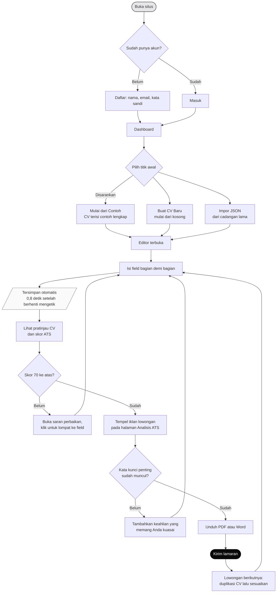

# Panduan Pengguna

Petunjuk pemakaian aplikasi **CV ATS Builder** dari awal sampai CV siap
dikirim. Ditulis untuk pengguna yang baru pertama kali membuat CV sekalipun.

Versi ringkas panduan ini juga tersedia langsung di dalam aplikasi pada
halaman **Panduan**.

---

## Daftar Isi

1. [Sebelum mulai: apa itu ATS](#1-sebelum-mulai-apa-itu-ats)
2. [Alur penggunaan](#2-alur-penggunaan)
3. [Membuat akun](#3-membuat-akun)
4. [Membuat CV pertama](#4-membuat-cv-pertama)
5. [Mengenal layar editor](#5-mengenal-layar-editor)
6. [Mengisi tiap bagian](#6-mengisi-tiap-bagian)
7. [Membaca skor ATS](#7-membaca-skor-ats)
8. [Mencocokkan dengan iklan lowongan](#8-mencocokkan-dengan-iklan-lowongan)
9. [Panjang dan ukuran kertas](#9-panjang-dan-ukuran-kertas)
10. [Mengunduh CV](#10-mengunduh-cv)
11. [Membandingkan CV yang sudah ada](#11-membandingkan-cv-yang-sudah-ada)
12. [Mengelola banyak CV](#12-mengelola-banyak-cv)
13. [Bahasa dan mode tampilan](#13-bahasa-dan-mode-tampilan)
14. [Memakai dari ponsel](#14-memakai-dari-ponsel)
15. [Pengaturan akun dan data](#15-pengaturan-akun-dan-data)
16. [Kalau ada masalah](#16-kalau-ada-masalah)

---

## 1. Sebelum mulai: apa itu ATS

**ATS** (*Applicant Tracking System*) adalah perangkat lunak yang dipakai
banyak perusahaan untuk menerima dan menyaring lamaran. Sebelum sampai ke
tangan manusia, berkas CV diurai lebih dulu oleh mesin untuk diambil datanya:
nama, kontak, riwayat pekerjaan, dan keahlian.

Masalahnya, cara kebanyakan orang membuat CV justru menyulitkan proses itu:

| Yang sering dipakai | Kenapa bermasalah |
|---|---|
| Tata letak dua kolom | Mesin membaca dari kiri ke kanan menyeberangi kedua kolom, sehingga kalimat tercampur |
| Tabel untuk merapikan | Isi antar-sel terbaca melompat-lompat |
| Ikon menggantikan tulisan | Ikon telepon tanpa label membuat nomor tidak dikenali sebagai nomor telepon |
| CV disimpan sebagai gambar | Tidak ada teks sama sekali yang bisa diambil |
| Judul kreatif seperti "Jejak Karierku" | Mesin mencocokkan judul dengan daftar baku; judul tak dikenal membuat seluruh isinya gagal dipetakan |

Aplikasi ini menutup semua kemungkinan tersebut sejak awal. Anda hanya mengisi
field - tata letaknya diurus aplikasi, dan semua template sudah dipastikan
memenuhi kaidah di atas.

---

## 2. Alur penggunaan



Diagram yang sama - beserta tiga diagram lain: alur membandingkan CV,
arsitektur, dan workflow pengembangan - tersedia juga sebagai berkas gambar di
[`docs/diagram/`](diagram/), dan dapat dilihat langsung di halaman **Alur**
pada aplikasinya.

---

## 3. Membuat akun

1. Buka halaman utama, tekan **Daftar Gratis**.
2. Isi nama lengkap, email aktif, dan kata sandi minimal 8 karakter.
3. Tekan **Buat Akun**. Anda langsung masuk tanpa perlu mengetik ulang.

Bila tombol **Masuk dengan Google** tersedia, Anda dapat memakainya sebagai
gantinya - tidak perlu mengingat kata sandi baru.

> **Kenapa harus punya akun?** Karena inilah yang membuat CV Anda tersimpan.
> Tanpa akun, data akan hilang begitu tab ditutup.

**Kata sandi Anda tidak pernah disimpan apa adanya.** Yang masuk ke basis data
hanya hasil pengacakan satu arah (*hash* bcrypt), sehingga tidak dapat dibaca
kembali oleh siapa pun - termasuk pengelola aplikasi.

---

## 4. Membuat CV pertama

Di dashboard ada tiga tombol:

| Tombol | Kapan dipakai |
|---|---|
| **Mulai dari Contoh** | **Disarankan untuk pemakaian pertama.** CV langsung terisi contoh lengkap dan realistis. Anda bisa melihat bentuk CV jadi, lalu menimpanya dengan data sendiri satu per satu. |
| **Buat CV Baru** | Mulai dari kosong. Cocok bila Anda sudah paham bentuk CV yang dituju. |
| **Impor JSON** | Memulihkan CV dari berkas cadangan yang pernah Anda unduh. |

---

## 5. Mengenal layar editor

Layar editor terbagi dua di komputer dan tablet lebar:

```
┌──────────────────────────────┬────────────────────────────────┐
│  KIRI - FORMULIR             │  KANAN - PRATINJAU CV          │
│                              │                                │
│  ▾ Data Pribadi              │   ┌──────────────────────────┐ │
│     Nama Lengkap  [........]─┼──▶│      BUDI SANTOSO        │ │
│     Email         [........] │   │  Frontend Developer      │ │
│                              │   │  budi@email.com · +62... │ │
│  ▸ Ringkasan Profil      (1) │   ├──────────────────────────┤ │
│  ▸ Pengalaman Kerja      (3) │   │  RINGKASAN PROFIL        │ │
│  ▸ Pendidikan            (2) │   │  ░░░░░░░░░░░░░░░░░░░░░   │ │
│  ▸ Keahlian             (15) │   │                          │ │
│                              │   │  PENGALAMAN KERJA        │ │
│  ✓ Tersimpan 14.33           │   └──────────────────────────┘ │
└──────────────────────────────┴────────────────────────────────┘
      Isi Data Contoh · Tampilan · PDF · Word · Teks · JSON
```

Tiga hal yang membuat Anda selalu tahu sedang mengisi bagian mana:

1. **Pratinjau langsung** - CV di kanan berubah seketika saat Anda mengetik.
2. **Sorotan sinkron** - begitu sebuah field disentuh, bagian yang bersangkutan
   di CV ikut disorot berwarna kuning.
3. **Penghitung isi** - angka di sebelah judul bagian menunjukkan berapa entri
   yang sudah terisi.

**Bagian yang kosong tidak akan dicetak di CV**, jadi Anda bebas melewatkan
bagian yang tidak relevan.

### Mengubah urutan bagian

Gunakan tombol panah atas dan bawah di sisi kanan judul setiap bagian.
Urutannya langsung berubah di pratinjau.

### Mengubah tampilan

Tombol **Tampilan** membuka pengaturan template, ukuran kertas, jenis huruf,
ukuran huruf, jarak baris, dan bahasa judul bagian. Semua pilihan jenis huruf
yang tersedia sudah dipastikan aman untuk ATS.

Tersedia **sepuluh template**, dikelompokkan menjadi dua:

| Kelompok | Template |
|---|---|
| Tanpa foto | Klasik, Modern, Padat, Eksekutif, Minimalis, Kronologis, Akademik, Instansi |
| Dengan foto | Berfoto - Formal (pasfoto 3x4 di kanan atas), Berfoto - Bulat (foto bulat di tengah atas) |

Seluruhnya bertata letak satu kolom tanpa tabel, dengan judul bagian baku.
Yang berbeda hanya tipografi, jarak, garis, dan penempatan foto - jadi tidak
ada template yang lebih berisiko terbaca kacau dibanding yang lain, dan
berganti template tidak mengubah data Anda sedikit pun.

### Melihat pratinjau per halaman

Di atas pratinjau ada dua tombol: **Per halaman** dan **Sambung**.

- **Per halaman** memotong dokumen menjadi lembaran terpisah seperti di
  pengolah kata, sehingga Anda melihat persis kalimat mana yang jatuh ke
  halaman berikutnya.
- **Sambung** menampilkannya sebagai satu gulungan panjang - lebih nyaman
  dibaca cepat sambil menyunting.

Keduanya menampilkan dokumen yang sama; yang berbeda hanya cara melihatnya.

### Mengetik langsung di atas kertas

Di sebelah kedua tombol itu ada tombol **Ketik di kertas**. Menyalakannya
membuat CV di sebelah kanan dapat diklik dan diketik langsung, seperti di
pengolah kata.

Yang Anda ketik di kertas **masuk ke field di panel kiri**, dan sebaliknya -
keduanya satu CV yang sama, bukan dua salinan. Jadi Anda bebas memilih: isi
lewat field dulu lalu rapikan kalimatnya di atas kertas, atau langsung
mengetik di kertas sejak awal.

Hampir seluruh isi CV dapat disunting dari kertas, masing-masing dengan cara
yang sesuai bentuk datanya:

| Yang disunting | Caranya |
|---|---|
| Nama, jabatan, ringkasan | Klik teksnya, lalu ketik |
| Judul tiap entri, nama perusahaan, institusi, kota, negara | Klik bagiannya masing-masing. Ketiganya tampil sebaris, tetapi tiap bagian punya tempatnya sendiri - jadi mengetik kota tidak akan menyentuh nama perusahaan |
| Nama keahlian, nama bahasa, penerbit sertifikat, penerbit publikasi | Klik teksnya, lalu ketik |
| Seluruh poin pencapaian | Klik teksnya. **Enter** di akhir sebuah poin membuat poin berikutnya, seperti di pengolah kata |
| Periode dan tanggal | Klik periodenya - muncul pemilih bulan berisi bulan mulai, bulan selesai, dan centang "Masih berlangsung" |
| Menambah entri | Tombol **+ Tambah entri** di ujung tiap bagian |

**Field yang masih kosong tetap dapat diklik.** Selama mode ketik menyala, ia
tampil sebagai tulisan samar berisi namanya - "Kota", "Negara", "Poin
pencapaian". Tulisan itu hanya penanda tempat: ia tidak pernah ikut tercetak,
dan tidak akan tersimpan sebagai isi CV bila Anda mengkliknya lalu keluar tanpa
mengetik apa pun.

Yang tetap lewat field di panel kiri:

| Hal | Mengapa |
|---|---|
| Alamat proyek dan alamat sertifikat | Yang tampil di kertas sudah dirapikan tanpa `https://`. Menulis balik apa yang terlihat akan menghapus bagian yang sengaja disembunyikan itu |
| Kategori keahlian dan urutan bagian | Keduanya mengatur susunan CV, bukan isinya |
| Memulai bagian yang masih kosong | Bagian tanpa satu pun entri memang tidak dicetak, jadi tidak ada tempat untuk meletakkan tombolnya di kertas |

Beberapa hal yang perlu diketahui:

- Tekan **Enter** untuk menyelesaikan suntingan - kecuali di poin pencapaian,
  tempat Enter membuat poin baru. **Esc** membatalkan dan mengembalikan teks
  semula.
- Poin yang Anda tinggalkan kosong dibersihkan sendiri begitu mode ketik
  dimatikan. Selama masih menyala poin kosong sengaja dibiarkan terlihat,
  supaya poin yang baru Anda buat tidak lenyap tepat saat hendak diketik.
- Karena field kosong ikut tampil selama mengetik, **jumlah halaman dapat
  terbaca lebih banyak dari yang sebenarnya**. Angkanya kembali tepat setelah
  mode ketik dimatikan; yang tercetak tidak pernah memuat penanda tempat itu.
- Menempel teks dari Word atau dari halaman web masuk sebagai teks polos -
  huruf dan warna asalnya tidak ikut, karena gaya CV ditentukan templatenya.
- Selama mengetik, tampilan berpindah ke **Sambung**. Pada tampilan per
  halaman dokumen terpotong di batas halaman, dan kursor tidak dapat
  menyeberangi potongan itu.

---

## 6. Mengisi tiap bagian

| Bagian | Isi | Catatan |
|---|---|---|
| **Data Pribadi** | Nama, jabatan yang dituju, email, telepon, domisili, tautan profil | Samakan jabatan dengan judul lowongan yang dilamar |
| **Ringkasan Profil** | 2-4 kalimat, 30-120 kata | Rumus: peran + lama pengalaman + keahlian utama + satu pencapaian berangka. Hindari kata "saya" |
| **Pengalaman Kerja** | Jabatan, perusahaan, periode, poin pencapaian | Urutkan dari yang paling baru. Minimal 2 poin per pengalaman |
| **Pendidikan** | Jenjang, program studi, institusi, periode, IPK | Cantumkan IPK bila 3.00 ke atas |
| **Keahlian** | Nama keahlian per kategori | Tulis apa adanya: "JavaScript", bukan "JavaScript (mahir)" |
| **Proyek** | Nama, peran, tautan, poin hasil | Sangat membantu bagi fresh graduate |
| **Sertifikasi** | Nama, penerbit, tanggal, ID kredensial | ID kredensial memudahkan verifikasi perekrut |
| **Organisasi** | Jabatan, organisasi, periode, poin kontribusi | Tunjukkan dampak, bukan sekadar keanggotaan |
| **Penghargaan** | Nama, pemberi, tanggal, keterangan | Sebutkan tingkat kompetisi dan peringkat |
| **Bahasa** | Nama bahasa dan tingkat penguasaan | Hindari diagram bintang; pakai tingkat baku |
| **Publikasi** | Judul, penerbit, tanggal, DOI | Relevan untuk jalur akademik dan riset |
| **Section Tambahan** | Bebas | Gunakan judul berupa teks biasa tanpa emoji |

### Menulis poin pencapaian yang kuat

Rumusnya: **kata kerja aksi + apa yang dikerjakan + hasil berangka**.

| Kurang baik | Lebih baik |
|---|---|
| Bertanggung jawab atas pengembangan website perusahaan. | Mengembangkan ulang halaman checkout sehingga tingkat konversi naik dari 2,1% menjadi 3,4% dalam 6 bulan. |
| Membantu tim dalam berbagai proyek. | Memimpin tim beranggotakan 4 orang dalam migrasi 60 komponen antarmuka, memangkas waktu pengembangan fitur sekitar 30%. |
| Menguasai React dan berbagai tools modern. | Menyusun 120 unit test dengan Jest dan React Testing Library, meningkatkan cakupan pengujian dari 38% menjadi 82%. |

> **Tidak punya angka?** Angka tidak selalu berarti persentase. Jumlah orang
> yang Anda latih, banyaknya dokumen yang Anda proses per minggu, atau jumlah
> peserta acara yang Anda selenggarakan - semuanya angka yang sah.

### Soal pas foto

Opsi menampilkan pas foto tersedia, tetapi **dimatikan secara bawaan**, dan
delapan dari sepuluh template memang tidak menyediakan tempatnya sama sekali.

Alasannya: sebagian besar pengurai ATS tidak dapat membaca gambar, dan tata
letak di sekitar foto kerap membuat urutan teks terbaca kacau. Di banyak
negara, foto juga dihindari untuk mengurangi bias dalam seleksi.

Bila lowongan Anda memang memintanya, nyalakan opsinya lalu pilih salah satu
template pada kelompok **Dengan foto**. Bila fotonya tidak muncul, hampir pasti
template yang sedang dipakai memang tidak menyediakan tempat foto.

**Cara memasang fotonya:** tekan **Pilih berkas foto**, lalu pilih berkas JPG,
PNG, atau WebP dari perangkat Anda. Foto dari kamera ponsel berukuran beberapa
megabyte tidak masalah - aplikasi mengecilkannya sendiri ke ukuran cetak 3x4
sebelum disimpan, jadi berkas CV Anda tidak ikut membengkak. Latar polos
memberi hasil paling baik, dan sekaligus paling ringan.

Fotonya tersimpan menyatu dengan CV, bukan sebagai berkas terpisah di suatu
tempat. Artinya foto itu ikut ke mana pun CV-nya pergi: ikut ke berkas PDF,
ikut ke berkas Word, dan ikut ke berkas JSON bila Anda mengunduhnya sebagai
cadangan. Tidak ada tautan yang bisa mati di kemudian hari.

---

## 7. Membaca skor ATS

Buka tab **Skor ATS** di sebelah pratinjau. Skor berada pada rentang 0-100,
dihitung sebagai rata-rata berbobot dari lima dimensi.

| Dimensi | Bobot | Memeriksa |
|---|---:|---|
| Kelengkapan Data | 25% | Apakah semua informasi yang dicari perekrut sudah ada |
| Keterbacaan Mesin | 25% | Format tanggal, kelengkapan pasangan jabatan-perusahaan, jenis huruf, foto |
| Kualitas Konten | 20% | Kata kerja aksi, angka terukur, panjang poin, frasa klise |
| Kecocokan Kata Kunci | 20% | Kata kunci lowongan yang muncul di CV (perlu iklan lowongan ditempel) |
| Panjang & Struktur | 10% | Jumlah halaman, urutan bagian, kronologi, jeda kerja |

| Nilai | Rentang | Artinya |
|:--:|---|---|
| A | 85-100 | Siap dikirim |
| B | 70-84 | Sudah baik, tinggal poles |
| C | 55-69 | Ada hal penting yang terlewat |
| D | 0-54 | Berisiko tersaring sebelum dibaca manusia |

Di bawah skor terdapat daftar temuan dalam tiga tingkat: **Harus diperbaiki**,
**Sebaiknya diperbaiki**, dan **Saran penyempurnaan**. Setiap temuan memiliki
tombol **Buka field terkait** yang melompat langsung ke field bermasalah.

> **Penting:** skor tinggi berarti CV Anda memenuhi kaidah yang diperiksa -
> bukan jaminan lolos seleksi. Setiap perusahaan memakai produk ATS berbeda
> dengan pengurai yang tidak dipublikasikan. Anggap skor ini sebagai daftar
> periksa, bukan ramalan hasil.

---

## 8. Mencocokkan dengan iklan lowongan

1. Dari editor, tekan **Cocokkan dengan lowongan**.
2. Salin **seluruh** teks iklan lowongan - termasuk bagian kualifikasi dan
   tanggung jawab - lalu tempel di kotak sebelah kiri.
3. Skor dan daftar kata kunci diperbarui seketika.

Anda akan melihat dua daftar: kata kunci yang **sudah ada** di CV, dan yang
**belum ada**. Tambahkan kata kunci yang belum ada ke bagian Keahlian atau ke
poin pencapaian.

> **Jangan menempelkan keahlian yang tidak Anda kuasai.** Skornya memang naik,
> tetapi akan terbongkar pada tahap wawancara.

Tombol **Simpan Hasil ke Riwayat** mencatat skor saat itu. Perbaiki CV Anda,
simpan lagi, dan Anda dapat melihat perkembangan skornya dari waktu ke waktu.

---

## 9. Panjang dan ukuran kertas

### Berapa halaman sebaiknya?

**Satu halaman.** Itu panjang yang tepat untuk hampir semua pelamar, termasuk
yang sudah berpengalaman. Perekrut memindai satu CV dalam hitungan detik, dan
apa pun yang jatuh ke halaman kedua besar kemungkinan tidak pernah terbaca.

Dua halaman baru sepadan bila Anda punya lebih dari lima tahun pengalaman yang
seluruhnya relevan dengan lowongan yang dituju. Tiga halaman hampir tidak
pernah dapat dibenarkan.

Bila CV Anda terlanjur panjang, yang perlu dipangkas **isinya** - bukan ukuran
hurufnya. Mengecilkan huruf sampai 8pt memang membuatnya muat, tetapi sekaligus
membuatnya tidak terbaca manusia maupun mesin OCR.

Indikator jumlah halaman di atas pratinjau memberi tahu keadaannya:

| Tampilan | Artinya |
|---|---|
| 1 halaman (hijau) | Panjang ideal |
| 2 halaman (abu) | Masih wajar bila pengalaman Anda lebih dari lima tahun |
| 3 halaman ke atas (kuning) | Terlalu panjang - perekrut umumnya hanya memindai halaman pertama |

### Margin halaman

Bawaannya mengikuti template yang Anda pilih - tiap template punya karakter
sendiri, dari Padat (12 mm) sampai Minimalis (18 mm). Bila kurang pas, atur
sendiri lewat dua penggeser di menu **Tampilan**:

| Penggeser | Rentang | Catatan |
|---|---|---|
| Margin Atas-Bawah | 8-30 mm | Berlaku pada **setiap** halaman, bukan hanya halaman pertama |
| Margin Kiri-Kanan | 8-30 mm | |

Selama belum Anda sentuh, penggesernya bertanda *(ikut template)* dan ikut
berubah sendiri setiap kali Anda mengganti template. Begitu Anda menggesernya,
angka Anda yang berlaku - dan muncul tautan **Kembalikan ke bawaan template**
bila ingin melepasnya lagi.

Di bawah 10 mm sebagian pencetak akan memotong tepi kertas, jadi angka itu
sebaiknya jadi batas bawah praktis Anda.

Margin yang sama dipakai pratinjau, berkas PDF, **dan** berkas Word - ketiganya
tidak mungkin berbeda.

### Ukuran kertas

| Ukuran | Kapan dipakai |
|---|---|
| **A4** | **Disarankan.** Standar di Indonesia dan hampir seluruh dunia; ini bawaan aplikasi |
| Letter | Lamaran ke perusahaan di Amerika Serikat atau Kanada |
| Legal | Hanya bila instansi yang dituju memintanya secara khusus |
| F4 (Folio) | Ukuran folio yang masih dipakai sebagian kantor di Indonesia |

Ukuran yang Anda pilih ikut terpakai saat mencetak, sehingga hasil PDF-nya
persis seukuran pratinjaunya.

---

## 10. Mengunduh CV

| Format | Kapan dipakai |
|---|---|
| **PDF** | Pilihan utama untuk dikirim ke perusahaan. Teksnya tetap dapat diseleksi dan disalin, sehingga terbaca mesin |
| **Word (.docx)** | Bila sistem lamaran secara khusus meminta berkas .doc atau .docx. Sebagian ATS mengurai Word lebih akurat daripada PDF |
| **Teks (.txt)** | Untuk ditempel ke formulir lamaran daring yang hanya menerima teks polos |
| **JSON** | Bukan format lamaran. Ini cadangan seluruh data Anda, dapat diimpor kembali kapan saja |

Saat menekan **PDF**, kotak dialog cetak peramban akan muncul. Pilih
**Save as PDF** sebagai tujuan, lalu simpan.

**CV yang Anda unduh murni berisi data Anda sendiri** - tanpa logo, tanpa
watermark, dan tanpa nama aplikasi maupun pembuatnya.

---

## 11. Membandingkan CV yang sudah ada

Halaman **Bandingkan CV** menerima berkas PDF, DOCX, atau TXT dari mana pun -
termasuk CV lama yang dibuat di aplikasi lain. Tidak perlu punya akun untuk
memakainya.

### Caranya

1. Jatuhkan **satu berkas** untuk memindainya, atau **dua sampai lima berkas**
   untuk membandingkannya.
2. Bila mau, tempel juga iklan lowongan yang Anda incar. Kecocokan kata
   kuncinya ikut dinilai - dan justru dimensi itulah yang paling menentukan CV
   mana yang sebaiknya Anda kirim untuk lowongan tersebut.
3. Tekan **Analisis Sekarang**.

### Yang Anda peroleh

- Skor 0-100 untuk setiap CV, beserta rinciannya per dimensi.
- **Daftar kelebihan** - hal yang sudah benar dan sebaiknya tidak diubah.
- **Daftar kekurangan** beserta cara memperbaikinya, terurut dari yang paling
  mendesak.
- Bila berkasnya lebih dari satu: **mana yang paling siap dikirim**, beserta
  alasannya - dimensi mana yang membuatnya unggul dan seberapa besar
  selisihnya.

### Soal privasi

Berkas Anda **tidak diunggah ke mana pun**. Seluruh pembacaan dan penilaian
berjalan di dalam peramban Anda sendiri; menutup halaman itu menghapus
semuanya. Itu pula sebabnya fitur ini dapat dipakai tanpa membuat akun.

### Bila berkas gagal dibaca

Pesan yang menyebut dokumen nyaris tidak memuat teks berarti CV Anda
kemungkinan berupa gambar hasil pindai atau ekspor gambar. Itu sendiri temuan
penting: ATS akan membacanya sebagai dokumen kosong, sebagus apa pun isinya.
Ekspor ulang sebagai PDF teks, bukan gambar.

---

## 12. Mengelola banyak CV

CV sebaiknya disesuaikan untuk setiap lowongan. Agar tidak perlu menyusun ulang
dari nol:

1. Di dashboard, tekan tombol **duplikat** pada CV yang ingin disalin.
2. Ganti namanya, misalnya "CV - Backend Engineer PT ABC".
3. Sesuaikan ringkasan profil dan urutan keahliannya dengan lowongan itu.

Setiap kartu CV di dashboard menampilkan skor ATS terakhir, template yang
dipakai, dan kapan terakhir diubah.

---

## 13. Bahasa dan mode tampilan

Dua tombol di bilah atas mengatur keduanya.

### Bahasa

Ikon bola dunia mengganti bahasa antarmuka antara **Indonesia** dan
**English**. Pilihan ini tersimpan, jadi tidak perlu diatur ulang setiap kali
berkunjung.

Perhatikan bahwa ini adalah bahasa **antarmuka**, bukan bahasa CV. Bahasa judul
bagian di dalam CV diatur terpisah lewat menu Tampilan - karena orang yang sama
bisa saja memakai antarmuka bahasa Indonesia untuk menyusun CV berbahasa
Inggris, dan itu memang lazim.

### Mode terang dan gelap

Ikon matahari atau bulan adalah sakelar: sekali tekan, tampilan langsung
berganti. Tidak ada menu yang perlu dibuka.

Kunjungan pertama Anda mengikuti setelan perangkat - bila ponsel atau komputer
Anda sedang bermode gelap, aplikasinya ikut gelap. Begitu Anda menekan
sakelarnya, pilihan Anda yang berlaku dan tersimpan untuk kunjungan berikutnya.

Kertas CV di panel pratinjau tetap putih pada kedua mode, karena itulah yang
akan tercetak.

---

### Berpindah dan kembali antarhalaman

Setiap halaman dalam memiliki **jejak navigasi** di bagian atas, misalnya
*Beranda › Panduan*. Tekan bagian "Beranda" untuk kembali - tidak perlu memakai
tombol kembali peramban, yang tidak berfungsi bila halaman itu Anda buka
langsung dari tautan yang dibagikan orang.

Halaman Pengaturan punya tautan **Kembali ke dashboard**, dan halaman masuk
punya **Kembali ke beranda** di pojok kanan atas.

---

## 14. Memakai dari ponsel

Aplikasi ini dapat dipakai penuh dari ponsel. Layar dibagi menjadi tiga panel
yang dapat diganti lewat bilah di bagian bawah:

| Panel | Isi |
|---|---|
| **Isi Data** | Formulir seluruh bagian CV |
| **Pratinjau** | CV ukuran A4, perbesarannya otomatis disesuaikan lebar layar |
| **Skor ATS** | Penilaian beserta daftar saran |

Seluruh tombol unduhan dan pengaturan diringkas ke dalam menu **⋯** di pojok
kanan atas.

Anda juga dapat memasang aplikasi ini ke layar utama ponsel lewat menu
peramban ("Tambahkan ke Layar Utama"), sehingga terbuka seperti aplikasi biasa.

---

## 15. Pengaturan akun dan data

Halaman **Pengaturan** menyediakan:

- **Ubah nama tampilan.**
- **Ubah kata sandi** - wajib memasukkan kata sandi lama terlebih dahulu.
- **Buat kata sandi** - bagi akun yang mendaftar lewat Google dan belum
  memiliki kata sandi.
- **Hapus akun** - menghapus seluruh CV beserta isinya secara permanen.
  Konfirmasinya sengaja dibuat merepotkan (harus mengetik `HAPUS AKUN`) agar
  tidak terjadi karena salah tekan.

> **Sebelum menghapus akun**, unduh cadangan JSON setiap CV Anda. Setelah
> dihapus, datanya tidak dapat dikembalikan.

---

## 16. Kalau ada masalah

| Gejala | Penyebab dan solusi |
|---|---|
| Muncul "Gagal menyimpan" | Koneksi internet terputus. Jangan tutup halaman - data yang sudah diketik masih ada di layar. Setelah koneksi pulih, ketik satu huruf apa saja untuk memicu penyimpanan ulang |
| CV menjadi tiga halaman | Indikator jumlah halaman berubah kuning. Pangkas pengalaman yang tidak relevan, gabungkan poin yang mirip, atau kecilkan ukuran huruf lewat menu Tampilan |
| Tombol PDF tidak memunculkan apa pun | Dialog cetak mungkin terblokir. Matikan pemblokir pop-up untuk situs ini, atau unduh format Word yang tidak memerlukan dialog cetak |
| Bagian yang diisi tidak muncul di CV | Bagian yang seluruh entrinya kosong sengaja tidak dicetak. Pastikan minimal satu field pada entri itu terisi |
| Lupa kata sandi | Pemulihan lewat email belum tersedia. Bila email Anda sama dengan akun Google, masuklah lewat tombol Google, lalu buat kata sandi baru di halaman Pengaturan |
| Terlalu banyak percobaan masuk | Demi keamanan, percobaan masuk dibatasi 8 kali per 15 menit untuk tiap alamat email. Tunggu beberapa saat lalu coba lagi |
